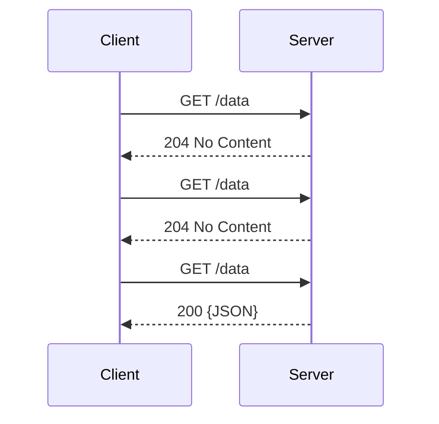
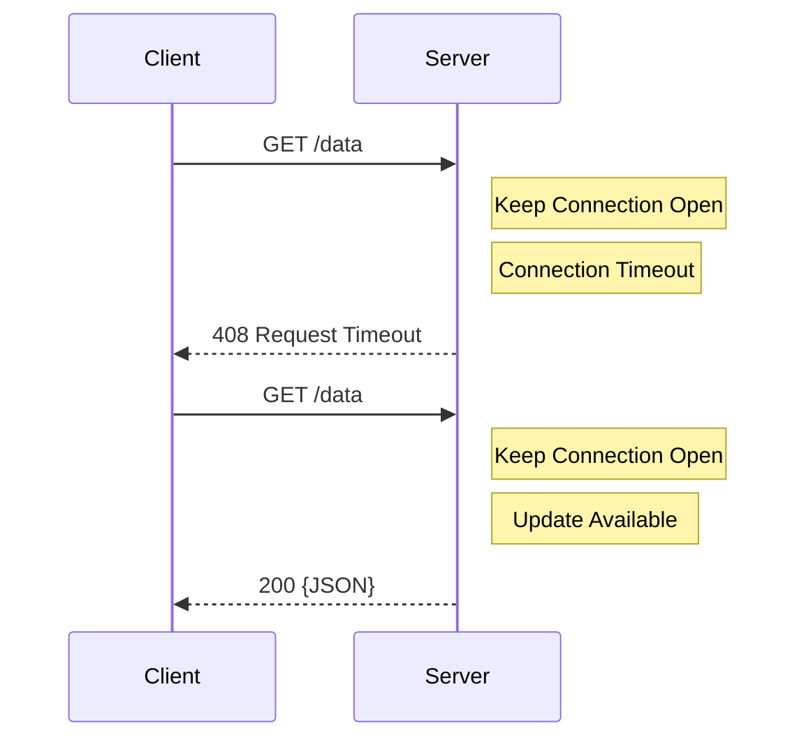

## Polling!
If you are accustomed to working with applications that adhere to a client-server architecture, then you are likely familiar with the process of retrieving data from a server using HTTP request-response communication pattern. This typically involves the application sending an HTTP request to a server and waiting for a response. However, when it comes to polling, the application periodically makes these requests to the server at fixed time intervals to obtain new data. The way the server handles these periodic requests depends on whether the type of polling is short or long.

## Short Polling

Short polling can be described and understood quite easily. It starts with the client making a request to the server, which then responds with either an empty response or some form of data. Upon receiving the server's response, the client adheres to the defined time interval for all subsequent requests.

### Benefits

- Simplicity: Short polling is relatively straight forward to implement in comparison to other near real time update techniques.
- Compatibility: Through it simplicity short polling can be implemented in nearly all environments as it does not require any special or specific protocols.
- Caching: Short polling can work well with caching mechanisms. Responses can be cached by the client or an intermediate proxy in turn reducing the redundant requests to the server.

### Drawbacks

- Wasteful: Short polling involves making many requests being made to the server and if not properly managed can result in unnecessary bandwidth consumption, queries, and various resource use.
- Latency: Short polling uses a fixed time interval between requests resulting in hard latency set by the polling frequencies.
- Scalability: The simplicity of shorting polling can be negated by increasing the number of connections.  

## Long Polling

In long polling, the client sends a request to the server, which may not provide an immediate response. Instead, the server holds the request open, actively monitoring for updates or new data. Once new data becomes available, the server responds to the client with the updated information. If a timeout occurs without any new data, the server sends a response indicating the lack of updates, and the client can then initiate a new request.

### Benefits

- Reduced Wastefulness: In comparison, long polling reduces the wasteful aspects of short polling by letting the server keep the connection open and waiting for response when update is available.
- Simplicity.
- Compatibility.
- Caching.

### Drawbacks

- Wasteful: Less than short polling but not as efficient as other near real-time techniques.
- Latency.
- Scalability.

## Conclusion

Polling, whether short or long, offers certain advantages and disadvantages in web applications. It provides a simple and compatible way to retrieve real-time or periodic updates from the server. However, it can also result in increased network traffic, latency, and server load if not managed effectively.

The decision to use polling depends on the specific requirements of the application. Polling can be appropriate when near real-time or periodic updates are needed, especially when the overhead of persistent connections or more advanced techniques is not necessary. It can be suitable for applications like status monitoring, dynamic content display, and collaborative editing.